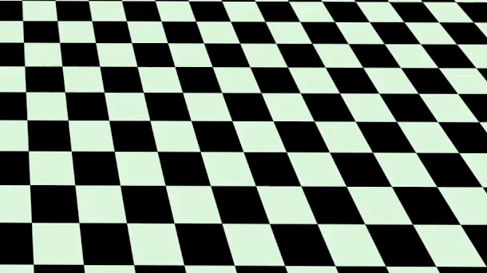

- 👋 Hi, there. I'm Ali.
- :school: I completed my MEng in Mechanical Engineering specializing in robotics from the University of Ottawa.
- 🌱 I’m currently learning ROS and Reinforcement Learning.
- 💞️ I'm actively doing research in the fields of Reinforcement Learning, Robotics, VSLAM, and Computer Vision.
- :star: I'm enthusiastic about research and collaboration on robotics projects.
- 📫 Contact me:

 

 

<!---
- 👀 I'm passionately looking for a supervisor to continue my education toward MASc or Ph.D.
- [akari103@uottawa.ca](mailto:akari103@uottawa.ca)

ake1999/ake1999 is a ✨ special ✨ repository because its `README.md` (this file) appears on your GitHub profile.
You can click the Preview link to take a look at your changes.
--->
